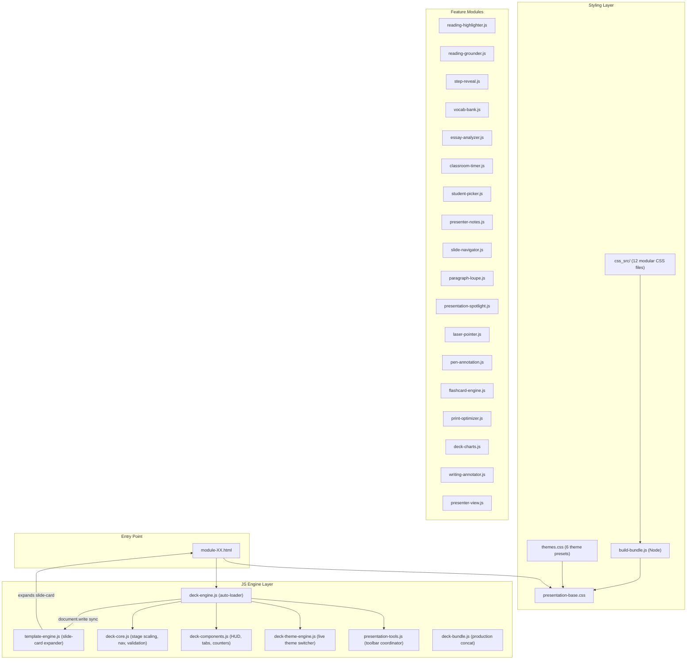

# Expert IELTS Presentations — Architecture Analysis & Reusable Rules

## 1. Architecture Overview



---

## 2. Core Logic Patterns

### 2.1 Two Rendering Modes

| Mode | Usage | When |
|:---|:---|:---|
| **Native `<section class="slide">`** | Older modules (E5) | Full HTML written by hand inside `<section>` tags |
| **Declarative `<slide-card>`** | Newer modules (E6+) | Compact custom element expanded by `template-engine.js` |

The `template-engine.js` runs **synchronously before `deck-core.js`** — it expands every `<slide-card>` into a full `<section class="slide">` by:
1. Looking up `template="..."` → `#tmpl-{name}`
2. Cloning the `<template>` content
3. Filling `[data-slot]` targets from child `[slot]` elements
4. Applying `skill` → color mapping
5. Auto-numbering all slides (`01 / 42`)

### 2.2 Answer Checking System

Three global functions power all interactivity:

| Function | Trigger | Logic |
|:---|:---|:---|
| `checkAnswers(btn)` | "Check Answers" button | Walks up to parent `.slide`, finds all `[data-ans]` inputs/selects, normalizes smart quotes, compares case-insensitively, applies `.correct`/`.wrong` classes, reveals `.item-explanation` on correct items |
| `revealAnswers(btn)` | "Reveal Keys" / "Show Highlights" | Sets all inputs/selects to their `data-ans` value, activates all `.syn-pair-*` with `.active-syn`, shows all `.item-explanation`, highlights all `<mark class="evidence">` |
| `resetAnswers(btn)` | "Reset" button | Clears all inputs, removes `.correct`/`.wrong`/`.active-syn` classes, hides `.item-explanation`, removes evidence highlighting |

### 2.3 Evidence & Synonym Grounding System

```
Question Card (.q-card)
  └─ data-q="kw-1"
  └─ .syn-pair-1[data-q="kw-1"]  → Green anchor
  └─ .syn-pair-2[data-q="kw-1"]  → Purple qualifier
  └─ .syn-btn[data-ev="ev-kw-1"] → 💡 Evidence button

Reading Passage
  └─ <mark class="evidence" id="ev-kw-1" data-q="kw-1">
       └─ .syn-pair-1[data-q="kw-1"]  → Green match
       └─ .syn-pair-2[data-q="kw-1"]  → Purple match
```

When `💡 Evidence` is clicked:
1. Scrolls `.reading-pane` to `<mark id="ev-kw-1">`
2. Activates `.active-syn` on matching `data-q` spans in both panes
3. Adds glow animation to the evidence mark

### 2.4 Step Reveal Engine (E key)

- Scans the current slide for `.q-card[data-q]` elements
- Maintains an internal pointer (`currentStep`)
- Each press of <kbd>E</kbd> reveals the next card's `.syn-pair-*` highlights
- The engine auto-injects a `👉 Step Reveal (E)` button into `.action-row` when `.q-card` elements are detected

---

## 3. The 16 Built-in Templates

| # | Template ID | Skill | Layout | Primary Slots |
|:--|:---|:---|:---|:---|
| 1 | `tmpl-title` | title | Full-width two-panel | `badge`, `title`, `subtitle`, `tags`, `roadmap` |
| 2 | `tmpl-section-divider` | title | Centered column | `badge`, `title`, `subtitle`, `content` |
| 3 | `tmpl-walkthrough` | read | Stacked (up-down) | `passage-header`, `passage-text`, `question-text`, `input-area`, `explanation` |
| 4 | `tmpl-reading-split` | read | 50/50 two-col | `badge`, `title`, `passage`, `questions` |
| 5 | `tmpl-strategy` | read | Two-col (1.2/0.8) | `subtitle`, `sentences`, `guide` |
| 6 | `tmpl-grammar-masterclass` | grammar | Two-col (1.1/0.9) | `rules`, `contrast-card` |
| 7 | `tmpl-exercise-grid` | grammar | Full-width grid | `badge`, `instruction`, `grid` |
| 8 | `tmpl-writing-model` | write | Two-col (0.9/1.1) | `prompt`, `annotations`, `essay` |
| 9 | `tmpl-vocab-cards` | vocab | 4-column grid | `subtitle`, `cards` |
| 10 | `tmpl-syntax-rules` | vocab | Sentence + two-col | `sentence`, `parts-of-speech`, `rules` |
| 11 | `tmpl-gap-fill-passage` | vocab | Two-col (1.1/0.9) | `passage`, `rules-col` |
| 12 | `tmpl-spelling-table` | write | Two-col (1.05/0.95) | `left-extract`, `right-table` |
| 13 | `tmpl-summary-checklist` | review | 2-col grid | `subtitle`, `grid` |
| 14 | `tmpl-reading-flowchart` | read | Split + flowchart | `passage`, `flowchart` |
| 15 | `tmpl-flowchart` | read | Standalone flowchart | `subtitle`, `flowchart` |
| 16 | `tmpl-standard` | read | Single column body | `subtitle`, `content`, `actions` |

---

## 4. Mandatory Rules (Extracted from Codebase)

### Rule 1: Slide Structure Hierarchy
Every slide MUST follow this DOM nesting:
```html
<section class="slide" id="slide-N" data-skill="read|grammar|vocab|write|review|title">
  <div class="slide-inner">
    <div class="notebook">
      <div class="skill-stripe" style="background: var(--col-{skill});"></div>
      <div class="page-content">
        <div class="slide-header">
          <div class="slide-title-group">
            <span class="skill-badge" style="background: var(--col-{skill});">Badge</span>
            <h2 class="slide-title">Title</h2>
          </div>
          <div class="slide-number">01 / 42</div>
        </div>
        <!-- Content area -->
        <!-- Action row -->
      </div>
    </div>
  </div>
</section>
```

### Rule 2: Skill-Color Token Mapping
| Skill | CSS Variable | Default Hex |
|:---|:---|:---|
| Reading | `--col-reading` | `#2563eb` |
| Grammar | `--col-grammar` | `#f43f5e` |
| Vocabulary | `--col-vocab` | `#059669` |
| Writing | `--col-writing` | `#7c3aed` |
| Review | `--col-review` | `#0891b2` |

### Rule 3: No Speaking Slides
Never create Speaking slides or Speaking exercises. Presentations cover Reading, Grammar, Vocabulary, and Writing only.

### Rule 4: 1-Question-Per-Walkthrough-Slide
Every reading question MUST have its own individual walkthrough slide. Never combine multiple questions into one slide.

### Rule 5: Action Row Standard
Every interactive slide must end with a clean `.action-row`:
```html
<!-- For exercise slides -->
<div class="action-row" style="margin-top: 10px;">
    <button class="btn-action btn-primary" onclick="checkAnswers(this)">Check Answers</button>
    <button class="btn-action" onclick="revealAnswers(this)">Reveal Keys</button>
    <button class="btn-action" onclick="resetAnswers(this)">Reset</button>
</div>

<!-- For strategy/highlight slides -->
<div class="action-row" style="margin-top: 14px;">
    <button class="btn-action btn-primary" onclick="revealAnswers(this)">💡 Show Highlights</button>
    <button class="btn-action" onclick="resetAnswers(this)">Reset</button>
</div>
```

### Rule 6: Input Types & Answer Attributes
| Input Type | CSS Class | Answer Format | Example |
|:---|:---|:---|:---|
| Dropdown select | `.select-input` | Single value | `data-ans="B"` |
| Text blank | `.blank-input` | Pipe-separated alternatives | `data-ans="chocolate\|cocoa"` |
| Multiple choice card | `.opt-card` | Boolean | `data-correct="true"` |
| Click-to-fill chip | `.word-chip` | Word value | `data-word="bitterly"` |

### Rule 7: Dual-Color Synonym Pairing
| Class | Role | Color | Purpose |
|:---|:---|:---|:---|
| `.syn-pair-1` | Anchor Concept | 🟢 Green | Core topic — used to locate paragraph |
| `.syn-pair-2` | Qualifying Claim | 🟣 Purple | Degree/condition — used to confirm answer |
| `.syn-pair-3` | Contrast/Distractor | 🟠 Orange | Trap or exception |

### Rule 8: Evidence Mark Pattern
```html
<mark class="evidence" id="ev-{questionKey}" data-q="{questionKey}">
    <span class="syn-pair-1" data-q="{questionKey}">anchor text</span>
    ...
    <span class="syn-pair-2" data-q="{questionKey}">qualifier text</span>
</mark>
```

### Rule 9: Paragraph Tagging
All reading passages must tag paragraphs:
```html
<span class="para-tag">[A]</span>
```

### Rule 10: Vocabulary Popover Markup
```html
<span class="vocab-word"
      data-word="reminisce"
      data-def="To talk or write about enjoyable past experiences."
      data-ipa="/ˌrem.ɪˈnɪs/"
      data-pos="verb"
      data-colloc="reminisce about the past">
    reminisce
</span>
```

---

## 5. Reusable `<slide-card>` Samples

### Sample A: Title Slide
```html
<slide-card template="title" skill="title">
    <span slot="badge">Module 05</span>
    <span slot="title">The World <span class="title-amp">&amp;</span> Around Us</span>
    <span slot="subtitle">IELTS Academic Preparation Masterclass<br>Climate Science, Relative Clauses, Academic Lexicon &amp; Task 2 Essays</span>
    <div slot="roadmap">
        <div class="title-skill-card" style="cursor:pointer;" onclick="deckEngine.jumpToSkill('read')">
            <div class="title-skill-name" style="color:var(--col-reading)">📖 Reading</div>
            <div class="title-skill-desc">Climate Change: Causes & Effects</div>
        </div>
        <div class="title-skill-card" style="cursor:pointer;" onclick="deckEngine.jumpToSkill('grammar')">
            <div class="title-skill-name" style="color:var(--col-grammar)">📐 Grammar</div>
            <div class="title-skill-desc">Defining & Non-Defining Relative Clauses</div>
        </div>
        <div class="title-skill-card" style="cursor:pointer;" onclick="deckEngine.jumpToSkill('vocab')">
            <div class="title-skill-name" style="color:var(--col-vocab)">🗂️ Vocabulary</div>
            <div class="title-skill-desc">Environmental Collocations & Intensifiers</div>
        </div>
        <div class="title-skill-card" style="cursor:pointer;" onclick="deckEngine.jumpToSkill('write')">
            <div class="title-skill-name" style="color:var(--col-writing)">✍️ Writing</div>
            <div class="title-skill-desc">Task 2: Agree/Disagree Essay Structure</div>
        </div>
    </div>
</slide-card>
```

### Sample B: Section Divider
```html
<slide-card template="section-divider" skill="title">
    <span slot="badge">Part B</span>
    <span slot="title">Digital Transformation</span>
    <span slot="subtitle">Matching Information, YES/NO/NOT GIVEN analysis, 
    academic vocabulary in context, and essay thesis construction.</span>
</slide-card>
```

### Sample C: Pre-Reading Strategy (Keyword Deconstruction)
```html
<slide-card template="strategy" skill="read"
    title="Matching Information: Question Keyword Deconstruction"
    subtitle="Click any sentence or press E to step-reveal the color-coded keywords.">
    <div slot="sentences">
        <div class="card q-card" data-q="strat-q-1" style="border-left: 4px solid var(--col-reading); padding: 14px 18px; cursor: pointer;">
            <div style="font-size: 16.5px; font-weight: 700; line-height: 1.55;">
                1. <span class="syn-pair-1" data-q="strat-q-1">Carbon emissions</span> have led to
                <span class="syn-pair-2" data-q="strat-q-1">a measurable rise in global temperatures</span>.
            </div>
        </div>
        <div class="card q-card" data-q="strat-q-2" style="border-left: 4px solid var(--col-reading); padding: 14px 18px; cursor: pointer;">
            <div style="font-size: 16.5px; font-weight: 700; line-height: 1.55;">
                2. <span class="syn-pair-1" data-q="strat-q-2">Deforestation</span> is
                <span class="syn-pair-2" data-q="strat-q-2">accelerating biodiversity loss</span>.
            </div>
        </div>
    </div>
    <div slot="guide">
        <div class="card" style="background: #ffffff; border-left: 4px solid var(--col-reading); padding: 18px 20px;">
            <h3 style="font-family: var(--font-display); font-size: 19px; color: var(--col-reading); margin-bottom: 10px;">
                🎯 Direct Sentence Color Code
            </h3>
            <div style="display: flex; flex-direction: column; gap: 12px; font-size: 15px; line-height: 1.6;">
                <div style="background: #dcfce7; padding: 10px 14px; border-radius: 6px; border: 1px solid #86efac;">
                    <strong style="color: #15803d;">🟢 Green (Anchor):</strong> Core topic nouns. Scan for these first.
                </div>
                <div style="background: #f3e8ff; padding: 10px 14px; border-radius: 6px; border: 1px solid #d8b4fe;">
                    <strong style="color: #6b21a8;">🟣 Purple (Qualifier):</strong> Degree words, outcomes. Confirm or refute.
                </div>
            </div>
        </div>
    </div>
</slide-card>
```

### Sample D: Full Split-View Reading Exercise
```html
<slide-card template="reading-split" skill="read"
    title="Reading: Climate Change — Matching Information (Qs 1–6)">
    <div slot="passage">
        <h3 style="font-family: var(--font-display); font-size: 20px; margin-bottom: 12px; color: var(--col-reading);">
            "The Carbon Footprint" — Environmental Impact Analysis
        </h3>
        <p><span class="para-tag">[A]</span> <mark class="evidence" id="ev-kw-1" data-q="kw-1">
            <span class="syn-pair-1" data-q="kw-1">Industrial greenhouse gas output</span> has been
            <span class="syn-pair-2" data-q="kw-1">directly correlated with rising sea levels</span>
        </mark> since the mid-twentieth century.</p>
        <p><span class="para-tag">[B]</span> Paragraph B text here...</p>
    </div>
    <div slot="questions">
        <h3 style="font-family: var(--font-display); font-size: 19px; margin-bottom: 6px; color: var(--col-reading);">
            Questions 1–6: Matching Information
        </h3>
        <div style="display: flex; flex-direction: column; gap: 10px; flex: 1; overflow-y: auto;">
            <div class="q-card" data-q="kw-1">
                <div style="display: flex; justify-content: space-between; align-items: center; gap: 6px;">
                    <span style="font-weight: 700; font-size: 15px;">
                        1. <span class="syn-pair-1" data-q="kw-1">Carbon emissions</span> have led to
                        <span class="syn-pair-2" data-q="kw-1">a measurable rise in global temperatures</span>.
                    </span>
                    <button class="syn-btn" data-ev="ev-kw-1">💡 Evidence</button>
                </div>
                <div style="margin-top: 8px;">
                    <select class="select-input" data-ans="A" style="width: 160px;">
                        <option value="">Paragraph...</option>
                        <option value="A">Paragraph A</option>
                        <option value="B">Paragraph B</option>
                    </select>
                </div>
                <div class="item-explanation">
                    <div class="syn-key-box">
                        <span class="syn-tag green">Green Match:</span> <em>"Carbon emissions"</em> ↔ <em>"Industrial greenhouse gas output"</em>
                    </div>
                    <div class="syn-key-box">
                        <span class="syn-tag purple">Purple Match:</span> <em>"measurable rise in temperatures"</em> ↔ <em>"rising sea levels"</em>
                    </div>
                </div>
            </div>
        </div>
    </div>
</slide-card>
```

### Sample E: 1-Question Walkthrough
```html
<slide-card template="walkthrough" skill="read"
    title="Walkthrough: Question 1 &amp; Paragraph [A]">
    <div slot="passage-header">📖 Passage Excerpt: Paragraph [A]</div>
    <div slot="passage-text" data-q="wt-q1" data-ev="ev-wt-q1">
        <span class="para-tag">[A]</span>
        <mark class="evidence" id="ev-wt-q1" data-q="wt-q1">
            <span class="syn-pair-1" data-q="wt-q1">Industrial greenhouse gas output</span> has been
            <span class="syn-pair-2" data-q="wt-q1">directly correlated with rising sea levels</span>
        </mark> since the mid-twentieth century.
    </div>
    <div slot="question-text" data-q="wt-q1" data-ev="ev-wt-q1">
        1. <span class="syn-pair-1" data-q="wt-q1">Carbon emissions</span> have led to
        <span class="syn-pair-2" data-q="wt-q1">a measurable rise in global temperatures</span>.
    </div>
    <div slot="input-area">
        <select class="select-input" data-ans="A" style="min-width: 200px; font-size: 17.5px; padding: 9px 16px; font-weight: 600;">
            <option value="">Select Answer...</option>
            <option value="A">Paragraph A</option>
            <option value="B">Paragraph B</option>
        </select>
    </div>
    <div slot="explanation">
        <div class="syn-key-box" style="margin-top:0; font-size: 17.5px;">
            <span class="syn-tag green" style="font-size: 14.5px;">Green Match:</span>
            <em>"Carbon emissions"</em> ↔ <em>"Industrial greenhouse gas output"</em>
        </div>
        <div class="syn-key-box" style="font-size: 17.5px;">
            <span class="syn-tag purple" style="font-size: 14.5px;">Purple Match:</span>
            <em>"measurable rise in temperatures"</em> ↔ <em>"rising sea levels"</em>
        </div>
    </div>
</slide-card>
```

### Sample F: Grammar Masterclass
```html
<slide-card template="grammar-masterclass" skill="grammar"
    title="Relative Clauses: Defining vs. Non-Defining">
    <div slot="rules">
        <div class="card" style="border-top: 4px solid var(--col-grammar); padding: 18px;">
            <h4 style="font-size: 18px; color: var(--col-grammar); margin-bottom: 8px;">
                📐 Defining Relative Clauses
            </h4>
            <p style="font-size: 16px; line-height: 1.7;">
                <strong style="color: var(--col-grammar);">Rule:</strong> Essential information — no commas.
                Uses <em>who, which, that, where, when, whose</em>.
            </p>
            <div style="background: #fef2f2; padding: 10px 14px; border-radius: 6px; margin-top: 8px; font-size: 15px;">
                <strong>Example:</strong> The students <strong style="color: var(--col-grammar);">who</strong>
                studied abroad performed better.
            </div>
        </div>
    </div>
    <div slot="contrast-card">
        <div class="card" style="border-top: 4px solid var(--text-muted); background: #fdf2f2; padding: 18px;">
            <h3 style="font-size: 18px; font-weight: 800; color: #991b1b; margin-bottom: 8px;">
                ❌ Common Errors
            </h3>
            <p style="font-size: 15px; line-height: 1.8;">
                ❌ "The city <s>who</s> I visited..." → ✅ "The city <strong style="color: var(--col-grammar);">which</strong> I visited..."
            </p>
        </div>
    </div>
</slide-card>
```

### Sample G: Exercise Grid (Gap-Fill)
```html
<slide-card template="exercise-grid" skill="grammar"
    title="Grammar Practice: Relative Pronoun Gap-Fill (Ex 4)"
    instruction="Complete each sentence with the correct relative pronoun.">
    <div slot="grid" style="display: grid; grid-template-columns: 1fr 1fr; gap: 14px; overflow-y: auto;">
        <div class="card q-card" style="border-left: 4px solid var(--col-grammar); padding: 14px 18px;">
            <p style="font-size: 16px; line-height: 1.8;">
                1. The research <input type="text" class="blank-input" data-ans="which|that" style="width: 110px;">
                was published last year has been cited 200 times.
            </p>
            <div class="item-explanation" style="font-size: 14.5px;">
                <strong>which/that</strong> — defining clause referring to "the research" (thing).
            </div>
        </div>
        <div class="card q-card" style="border-left: 4px solid var(--col-grammar); padding: 14px 18px;">
            <p style="font-size: 16px; line-height: 1.8;">
                2. Dr. Smith, <input type="text" class="blank-input" data-ans="who" style="width: 110px;">
                led the study, won a Nobel Prize.
            </p>
            <div class="item-explanation" style="font-size: 14.5px;">
                <strong>who</strong> — non-defining clause (commas) referring to a person.
            </div>
        </div>
    </div>
</slide-card>
```

### Sample H: Vocabulary Cards
```html
<slide-card template="vocab-cards" skill="vocab"
    title="Academic Lexicon: Environmental Collocations">
    <div slot="cards">
        <div class="card" style="border-top: 4px solid var(--col-vocab); padding: 16px; text-align: center;">
            <div style="font-size: 22px; font-weight: 800; color: var(--col-vocab); margin-bottom: 6px;">
                🔊 carbon footprint
            </div>
            <div style="font-size: 13px; color: var(--text-muted); font-family: var(--font-mono);">
                /ˈkɑː.bən ˈfʊt.prɪnt/ &nbsp;•&nbsp; noun phrase
            </div>
            <p style="font-size: 14.5px; margin-top: 8px; line-height: 1.5;">
                The total amount of greenhouse gases produced by human activities.
            </p>
            <div style="font-size: 13.5px; color: #475569; margin-top: 6px; font-style: italic;">
                "reduce your carbon footprint"
            </div>
        </div>
        <!-- More cards... -->
    </div>
</slide-card>
```

### Sample I: Writing Model Essay
```html
<slide-card template="writing-model" skill="write"
    title="Task 2: Agree/Disagree — Model Essay">
    <div slot="prompt">
        <div class="card" style="border-left: 5px solid var(--col-writing); padding: 18px;">
            <h4 style="font-size: 16px; color: var(--col-writing); margin-bottom: 8px;">📝 Task 2 Prompt</h4>
            <p style="font-size: 16px; line-height: 1.7; font-style: italic;">
                "Some people believe that environmental problems are too big for individuals to solve.
                To what extent do you agree or disagree?"
            </p>
        </div>
    </div>
    <div slot="essay">
        <div class="card" style="border-top: 4px solid var(--col-writing); padding: 22px;">
            <h4 style="font-size: 16px; color: var(--col-writing); margin-bottom: 10px;">
                ✨ Band 8.0 Model Response (278 words)
            </h4>
            <p style="font-size: 16px; line-height: 1.85;">
                <span class="writing-highlight signpost">While</span> it is true that global environmental
                challenges require governmental intervention, I <span class="writing-highlight signpost">firmly believe</span>
                that individuals <span class="writing-highlight signpost">play a crucial role</span> in mitigating
                ecological damage...
            </p>
        </div>
    </div>
</slide-card>
```

### Sample J: Spelling Table
```html
<slide-card template="spelling-table" skill="write"
    title="Spelling Traps: Common IELTS Task 2 Errors">
    <div slot="left-extract">
        <h4 style="font-size: 17px; color: var(--col-writing); margin-bottom: 10px;">
            📋 Spelling Challenge
        </h4>
        <p style="font-size: 16px; line-height: 2.0;">
            1. The goverment / <input type="text" class="blank-input" data-ans="government" style="width: 140px;"> must act.
        </p>
        <p style="font-size: 16px; line-height: 2.0;">
            2. This is occuring / <input type="text" class="blank-input" data-ans="occurring" style="width: 140px;"> worldwide.
        </p>
    </div>
    <div slot="right-table">
        <h4 style="font-size: 17px; color: var(--col-writing); margin-bottom: 10px;">
            🔍 Mnemonic Memory Aids
        </h4>
        <table style="width: 100%; font-size: 15px; border-collapse: collapse;">
            <tr><td style="padding: 8px; border-bottom: 1px solid #e2e8f0;"><s>goverment</s></td>
                <td style="padding: 8px; border-bottom: 1px solid #e2e8f0;"><strong>govern + ment</strong></td></tr>
            <tr><td style="padding: 8px;"><s>occuring</s></td>
                <td style="padding: 8px;"><strong>occur + r + ing</strong> (double consonant rule)</td></tr>
        </table>
    </div>
</slide-card>
```

### Sample K: Summary Checklist
```html
<slide-card template="summary-checklist" skill="review"
    title="Module Mastery: Achievement Checklist"
    subtitle="Review your progress across all skills covered in this module.">
    <div slot="grid">
        <div class="card" style="border-left: 5px solid var(--col-reading); padding: 16px;">
            <h4 style="font-size: 17px; color: var(--col-reading); margin-bottom: 8px;">📖 Reading</h4>
            <ul style="font-size: 15px; line-height: 1.8; padding-left: 18px;">
                <li>✅ Matching Information scanning technique</li>
                <li>✅ YES/NO/NOT GIVEN truth-value analysis</li>
                <li>✅ Synonym grounding and paraphrase bridges</li>
            </ul>
        </div>
        <div class="card" style="border-left: 5px solid var(--col-grammar); padding: 16px;">
            <h4 style="font-size: 17px; color: var(--col-grammar); margin-bottom: 8px;">📐 Grammar</h4>
            <ul style="font-size: 15px; line-height: 1.8; padding-left: 18px;">
                <li>✅ Defining vs. Non-defining relative clauses</li>
                <li>✅ Academic paragraph rewriting</li>
            </ul>
        </div>
    </div>
</slide-card>
```

### Sample L: Gap-Fill Passage with Word Bank
```html
<slide-card template="gap-fill-passage" skill="vocab"
    title="Vocabulary Practice: Intensifier Collocations (Ex 7)">
    <div slot="passage">
        <div style="font-weight: 700; font-size: 14px; color: var(--text-muted); margin-bottom: 8px;">
            WORD BANK (Click chip to fill focused blank):
        </div>
        <div style="display: flex; flex-wrap: wrap; gap: 8px; margin-bottom: 16px;">
            <span class="word-chip" data-word="bitterly">bitterly</span>
            <span class="word-chip" data-word="deeply">deeply</span>
            <span class="word-chip" data-word="highly">highly</span>
            <span class="word-chip" data-word="perfectly">perfectly</span>
        </div>
        <div style="font-size: 17px; line-height: 2.2;">
            <p>1. The results were <input type="text" class="blank-input" data-ans="bitterly" style="width:130px;"> disappointing.</p>
            <p>2. She is <input type="text" class="blank-input" data-ans="highly" style="width:130px;"> qualified for the position.</p>
        </div>
    </div>
    <div slot="rules-col">
        <div class="card" style="border-left: 4px solid var(--col-vocab); padding: 16px;">
            <h4 style="font-size: 16px; color: var(--col-vocab); margin-bottom: 8px;">📚 Intensifier Rules</h4>
            <p style="font-size: 15px; line-height: 1.7;">
                <strong>bitterly</strong> → disappointed, cold, opposed<br>
                <strong>deeply</strong> → concerned, moved, affected<br>
                <strong>highly</strong> → qualified, unlikely, competitive<br>
                <strong>perfectly</strong> → acceptable, clear, normal
            </p>
        </div>
    </div>
</slide-card>
```

---

## 6. Starter Boilerplate — New Module File

```html
<!DOCTYPE html>
<html lang="en" data-theme="bold-signal">
<head>
    <meta charset="UTF-8">
    <meta name="viewport" content="width=device-width, initial-scale=1.0">
    <title>Expert IELTS 6 — Module XX: [Topic]</title>

    <!-- Google Fonts -->
    <link rel="preconnect" href="https://fonts.googleapis.com">
    <link rel="preconnect" href="https://fonts.gstatic.com" crossorigin>
    <link href="https://fonts.googleapis.com/css2?family=DM+Sans:ital,opsz,wght@0,9..40,100..1000;1,9..40,100..1000&family=Playfair+Display:ital,wght@0,400..900;1,400..900&family=Plus+Jakarta+Sans:ital,wght@0,300;0,400;0,500;0,600;0,700;1,400&family=Space+Grotesk:wght@400..700&family=JetBrains+Mono:wght@400..700&display=swap" rel="stylesheet">

    <!-- Core Stylesheets -->
    <link rel="stylesheet" href="../presentation-base.css">
    <style>
        :root {
            --col-reading: #2563eb;
            --col-grammar: #f43f5e;
            --col-vocab:   #059669;
            --col-writing: #7c3aed;
            --col-review:  #0891b2;
            --stage-bg: #111827;
            --viewport-bg: radial-gradient(circle at 80% 20%, #881337 0%, #111827 70%);
        }
    </style>
</head>
<body>
    <div class="deck-viewport">
        <main class="deck-stage" id="deckStage">

            <!-- SLIDE 1: Title -->
            <slide-card template="title" skill="title">
                <!-- ... (see Sample A) ... -->
            </slide-card>

            <!-- SLIDE 2: Section Divider -->
            <slide-card template="section-divider" skill="title">
                <!-- ... (see Sample B) ... -->
            </slide-card>

            <!-- SLIDE 3: Pre-Reading Strategy -->
            <slide-card template="strategy" skill="read">
                <!-- ... (see Sample C) ... -->
            </slide-card>

            <!-- SLIDE 4: Full Split-View Reading -->
            <slide-card template="reading-split" skill="read">
                <!-- ... (see Sample D) ... -->
            </slide-card>

            <!-- SLIDES 5–N: Walkthrough per question -->
            <slide-card template="walkthrough" skill="read">
                <!-- ... (see Sample E, repeat per question) ... -->
            </slide-card>

            <!-- Grammar slides -->
            <slide-card template="grammar-masterclass" skill="grammar">
                <!-- ... (see Sample F) ... -->
            </slide-card>

            <!-- Vocab slides -->
            <slide-card template="vocab-cards" skill="vocab">
                <!-- ... (see Sample H) ... -->
            </slide-card>

            <!-- Writing slides -->
            <slide-card template="writing-model" skill="write">
                <!-- ... (see Sample I) ... -->
            </slide-card>

            <!-- Final: Summary -->
            <slide-card template="summary-checklist" skill="review">
                <!-- ... (see Sample K) ... -->
            </slide-card>

        </main>
    </div>

    <!-- Universal Presentation Engine -->
    <script src="../js/deck-engine.js"></script>
</body>
</html>
```

---

## 7. Build & Deploy Commands

| Task | Command |
|:---|:---|
| Build bundle (JS + CSS) | `node build-bundle.js` |
| Update master index | `npm run update-index` |
| Watch CSS changes | `npm run watch-css` |
| Push to GitHub | `push_to_github.bat` |

---

## 8. Theme System Quick Reference (24 Themes)

| Theme ID | Font Display | Font Body | Aesthetic & Mood | Scheme |
|:---|:---|:---|:---|:---|
| `academic` | Playfair Display | DM Sans | Classic Oxford Navy & Cream | Light |
| `bold-signal` | Space Grotesk | Plus Jakarta Sans | Brutalist Coral & Sharp Shadows | Light |
| `electric` | Manrope | Outfit | Cyberpunk Neon Cobalt & Dark Glass | Dark |
| `botanical` | Cormorant Garamond | Plus Jakarta Sans | Organic Emerald, Antique Gold & Warm Ivory | Light |
| `voltage` | Syne | Space Grotesk | Avant-Garde Deep Violet & Acid Lime | Dark |
| `vintage` | Bodoni Moda | DM Sans | Aged Sepia Newsprint & Bodoni Serif | Light |
| `soft-editorial` | Cormorant Garamond | Outfit | Warm Almond Paper with Sage & Blush | Light |
| `cobalt-grid` | Space Grotesk | DM Sans | Technical Precision Graph Paper & Cobalt Blue | Light |
| `vellum` | Cormorant Garamond | Plus Jakarta Sans | Deep Midnight Navy, Amber Serifs & Dusty Teal | Dark |
| `sakura-chroma` | Outfit | DM Sans | Vintage Japanese Cassette, Vermillion & Pink | Light |
| `editorial-forest` | Cormorant Garamond | DM Sans | Deep Pine Green, Dusty Blush & Warm Parchment | Light |
| `broadside` | Space Grotesk | Plus Jakarta Sans | Pitch-Black Broadsheet Void & Fire Orange | Dark |
| `8-bit-orbit` | Press Start 2P | Space Grotesk | CRT Pixel-Art Arcade, Neon Cyan & Magenta | Dark |
| `biennale-yellow` | Playfair Display | DM Sans | Solar Yellow, Parchment & Deep Indigo | Light |
| `block-frame` | Space Grotesk | Plus Jakarta Sans | Neobrutalist Pastel Blocks & Chunky Black Borders | Light |
| `coral` | Bebas Neue | DM Sans | Warm Cream Paper, Saturated Coral & Ink | Light |
| `editorial-tri-tone` | Bodoni Moda | DM Sans | Dusty Pink, Mustard Cream & Deep Burgundy | Light |
| `emerald-editorial` | Bodoni Moda | Manrope | Vivid Emerald Green, Navy Ink & Paper Cream | Light |
| `grove` | Cormorant Garamond | Plus Jakarta Sans | Natural Organic Earthy Olive & Warm Stone | Light |
| `monochrome` | Lora | DM Sans | Ivory Ledger Paper & Pure Ink-Black Typographic Restraint | Light |
| `pin-and-paper` | Caveat | DM Sans | Yellow Sticky Notes, Handwritten Ink & Corkboard | Light |
| `retro-windows` | VT323 | DM Sans | Windows 95 Nostalgic 3D Gray, Navy Bars & Pixel Type | Light |
| `stencil-tablet` | Space Grotesk | DM Sans | Bone Paper, Archaeological Terracotta & Ochre | Light |
| `cartesian` | Playfair Display | Plus Jakarta Sans | Quiet Minimalist Bone & Classical Playfair Elegance | Light |

Apply via: `<html data-theme="coral">` — switchable live with <kbd>Shift+T</kbd> or through the Teacher's Toolkit & HUD Theme Modal.

---

## 9. 4-Stage Reading Framework Summary

```
Stage 1 → Strategy Slide (keyword deconstruction, no passage)
Stage 2 → Full Split-View (complete passage + all questions)
Stage 3 → Walkthrough Slides (1 question per slide, stacked layout)
Stage 4 → Grammar / Vocab / Writing Mastery
```

> [!IMPORTANT]
> Every reading question gets its own walkthrough slide. Never group questions.

---

## 10. Master Keyboard Shortcuts Reference

| Shortcut | Function / Tool | Scope |
|:---|:---|:---|
| <kbd>→</kbd> / <kbd>Space</kbd> / <kbd>PgDn</kbd> | Next Slide | Presentation Navigation |
| <kbd>←</kbd> / <kbd>PgUp</kbd> | Previous Slide | Presentation Navigation |
| <kbd>Home</kbd> / <kbd>Shift + R</kbd> | Reset to Slide 1 | Presentation Navigation |
| <kbd>End</kbd> | Jump to Last Slide | Presentation Navigation |
| <kbd>Alt + P</kbd> | Launch Presenter Cockpit (Dual Screen) | Teacher Tools |
| <kbd>G</kbd> | Slide Grid Navigator & Search | Teacher Tools |
| <kbd>Shift + X</kbd> | Hide / Show Teacher Toolkit HUD | HUD Controls |
| <kbd>Shift + A</kbd> | Toggle 16:9 / 4:3 Aspect Ratio | Stage Geometry |
| <kbd>Shift + T</kbd> | Cycle 24 Theme Presets | Deck Theme Engine |
| <kbd>H</kbd> | Toggle Teacher Highlighter Pen | Annotation |
| <kbd>L</kbd> | Toggle Laser Pointer Dot | Annotation |
| <kbd>P</kbd> | Toggle Drawing Pen | Annotation |
| <kbd>C</kbd> | Clear All Drawings & Highlights | Annotation |
| <kbd>Ctrl + Z</kbd> | Undo Last Drawing / Highlight Stroke | Annotation |
| <kbd>B</kbd> / <kbd>.</kbd> | Blackout Screen (Mute) | Classroom Spotlight |
| <kbd>W</kbd> | Whiteout Screen (Whiteboard) | Classroom Spotlight |
| <kbd>S</kbd> | Follow-Cursor Spotlight Dimmer | Classroom Spotlight |
| <kbd>T</kbd> | Toggle Classroom Timer | Classroom Tools |
| <kbd>R</kbd> | Random Student Roulette Wheel | Classroom Tools |
| <kbd>N</kbd> | Presenter Notes Drawer | Teacher Tools |
| <kbd>Z</kbd> | Paragraph Loupe Focus & Zoom | Reading Mode |
| <kbd>E</kbd> | Step Reveal Exercise Answers | Interactivity |
| <kbd>F</kbd> | Toggle Fullscreen Mode | View Controls |
| <kbd>+</kbd> / <kbd>-</kbd> / <kbd>0</kbd> | Zoom Font (+ / - / Reset 100%) | Typography Scale |
| <kbd>?</kbd> | Show Keyboard Shortcuts Cheatsheet | Help Modal |
| <kbd>Escape</kbd> | Close All Modals / Deactivate Active Tools | Universal Exit |
