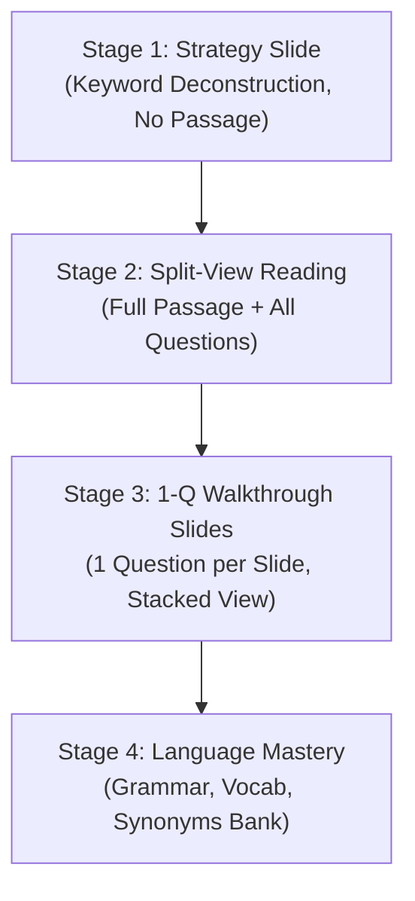

# IELTS Reading Grounding & Walkthrough Guide

The **4-Stage Reading Framework** is the pedagogical standard for all reading lessons in this repository. It guides students from keyword deconstruction to passage analysis, question-by-question walkthroughs, and language synthesis.

---

## 1. The 4-Stage Reading Framework



### Stage 1: Strategy & Keyword Deconstruction
- **Goal**: Teach students how to analyze questions BEFORE looking at the passage.
- **Rules**:
  - NO passage excerpt is displayed.
  - Questions are shown in isolation using `<slide-card template="strategy" skill="read">`.
  - Highlight keywords: **Green Anchor** (`.syn-pair-1`) for subjects/names/dates, **Purple Claim** (`.syn-pair-2`) for actions/findings/qualifiers.

### Stage 2: Full Split-View Reading
- **Goal**: Authentic exam condition simulation with complete passage and all questions.
- **Rules**:
  - Uses `<slide-card template="split-view" skill="read">`.
  - Left pane: Full passage with marked paragraph tags (`<span class="para-tag">[A]</span>`).
  - Right pane: All questions with interactive input controls (`select` dropdowns or text blanks).

### Stage 3: Walkthrough Slides (1 Question per Slide)
- **Goal**: Deep-dive step-by-step model walkthrough.
- **NON-NEGOTIABLE RULE**: **1 Question per walkthrough slide**. Never combine multiple questions onto a single walkthrough slide.
- **Structure**:
  - Uses `<slide-card template="walkthrough" skill="read">` (centered stacked layout).
  - Slot `passage-header`: Identifies the exact paragraph (e.g. `📖 Passage Excerpt: Paragraph [B]`).
  - Slot `passage-text`: Excerpt containing the evidence sentence wrapped in `<mark class="evidence" data-q="...">`.
  - Slot `question-text`: The single question with synchronized synonym spans.
  - Slot `input-area`: Interactive dropdown or blank.
  - Slot `explanation`: Two or three `.syn-key-box` entries explaining the exact match.

### Stage 4: Language Mastery
- **Goal**: Reinforce vocabulary, collocations, and grammar patterns extracted from the passage.
- **Templates**: Vocabulary grids (`word-bank`), matching pairs (`matching`), or drag gap-fills (`gapfill`).

---

## 2. Synonym Grounding Color Protocol

Every reading question and walkthrough uses a strict, universal color-matching protocol:

| Class | Color Role | What to Tag in Question & Passage | Example |
|:---|:---|:---|:---|
| **`.syn-pair-1`** | **Green Anchor** | The subject, main entity, proper noun, or noun phrase that anchors the question in the text. | Question: `<span class="syn-pair-1">Sharing experiences</span>`<br/>Passage: `<span class="syn-pair-1">Extraordinary experiences</span>` |
| **`.syn-pair-2`** | **Purple Qualifier** | The action, core predicate, claim, finding, or critical qualifier that answers the question. | Question: `<span class="syn-pair-2">immediate and long-term satisfaction</span>`<br/>Passage: `<span class="syn-pair-2">pleasurable in moment but leave us worse off</span>` |
| **`.syn-pair-3`** | **Blue Modifier** | Timeframe, secondary condition, contrastive conjunction, or geographical anchor (optional). | Question: `<span class="syn-pair-3">in the 19th century</span>`<br/>Passage: `<span class="syn-pair-3">between 1820 and 1890</span>` |

### Evidence Wrapping
The exact sentence or clause in the passage that provides proof MUST be wrapped in:
```html
<mark class="evidence" id="ev-q1" data-q="q1">
    <span class="syn-pair-1" data-q="q1">Passage Anchor</span> ... <span class="syn-pair-2" data-q="q1">Passage Claim</span>
</mark>
```

---

## 3. Walkthrough Slide Code Blueprint

Copy and adapt this exact blueprint for Stage 3 walkthrough slides:

```html
<slide-card template="walkthrough" skill="read">
    <span slot="badge">Reading Strategy • Model Walkthrough</span>
    <span slot="title">Model Walkthrough: Question 1 &amp; Paragraph [B]</span>
    <span slot="subtitle">Demonstration: Step-by-step evidence grounding and synonym deconstruction.</span>
    
    <!-- Top: Targeted Passage Excerpt -->
    <div slot="passage-header">📖 Passage Excerpt: Paragraph [B]</div>
    <div slot="passage-text">
        <span class="para-tag">[B]</span> <mark class="evidence" id="ev-q1" data-q="q1">"<span class="syn-pair-1" data-q="q1">Extraordinary experiences</span> are <span class="syn-pair-2" data-q="q1">pleasurable in the moment but can leave us socially worse off in the long run,"</span></mark> says study author Gus Cooney.
    </div>

    <!-- Middle: Single Question with Syn-pairs -->
    <span slot="question-text">
        1. <span class="syn-pair-1" data-q="q1">Sharing experiences</span> provides us with <span class="syn-pair-2" data-q="q1">immediate and long-term satisfaction</span>.
    </span>
    
    <!-- Input Control -->
    <div slot="input-area">
        <select class="select-input" data-ans="FALSE">
            <option value="">Select Answer...</option>
            <option value="TRUE">TRUE</option>
            <option value="FALSE">FALSE</option>
            <option value="NOT GIVEN">NOT GIVEN</option>
        </select>
    </div>

    <!-- Bottom: Color-Coded Explanation Boxes -->
    <div slot="explanation">
        <div class="syn-key-box" style="margin-top:0;">
            <span class="syn-tag green">Green Match:</span> <em>"Sharing experiences"</em> ↔ <em>"Extraordinary experiences"</em>
        </div>
        <div class="syn-key-box">
            <span class="syn-tag purple">Purple Match:</span> <em>"immediate &amp; long-term"</em> ↔ <em>"pleasurable in moment / worse off in long run"</em> (Contradicts)
        </div>
    </div>

    <!-- Action Row -->
    <div slot="actions">
        <button class="btn-action btn-primary" onclick="checkAnswers(this)">Check Answer</button>
        <button class="btn-action" onclick="revealAnswers(this)">Reveal Evidence</button>
        <button class="btn-action" onclick="resetAnswers(this)">Reset</button>
    </div>
</slide-card>
```

---

## 4. Paragraph Labeling Rules

Always wrap paragraph labels in `.para-tag`:
```html
<span class="para-tag">[A]</span>
<span class="para-tag">[B]</span>
<span class="para-tag">[C]</span>
```
- Never write bare `A.` or `Paragraph A:`.
- The `.para-tag` styling automatically renders bold, theme-accented badge pills.
